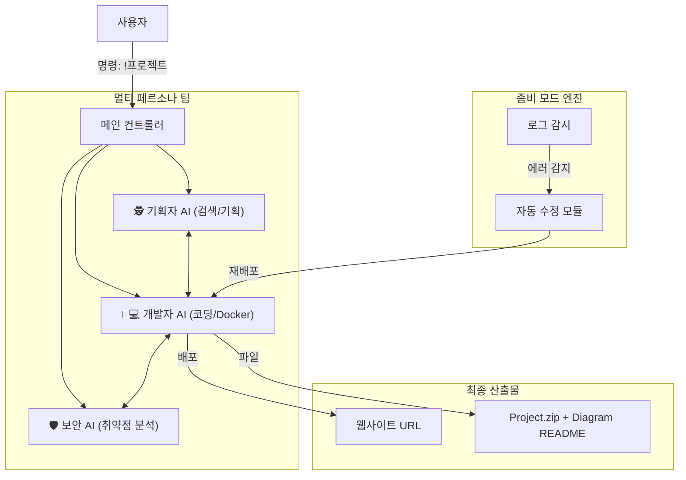

# 📑 최종 프로젝트 기획서: CodingDobby (The Living AI Dev Team)

## 1. 프로젝트 개요 (Overview)

**CodingDobby**는 단순한 코딩 봇이 아닌, 디스코드 내에 상주하는 **"자율형 AI 개발팀"**입니다.
사용자는 혼자 개발하는 것이 아니라, **기획자(PM), 개발자(Dev), 보안 전문가(Security)**로 이루어진 AI 페르소나들과 협업합니다. 또한, 이들은 사용자가 자는 동안에도 **서로 회의하고, 서버를 감시하며, 스스로 코드를 수정(Self-Healing)**합니다.

* **슬로건:** "24시간 잠들지 않는 나만의 개발팀."
* **핵심 가치:**
1. **협업성 (Swarm):** 단일 AI가 아닌, 역할이 분담된 전문 AI들의 집단지성.
2. **자율성 (Zombie):** 명령 없이도 스스로 유지보수하고 제안하는 능동적 에이전트.
3. **완결성 (Full-Stack):** 기획부터 배포, 문서화까지 전 과정 자동화.

---

## 2. 핵심 기능 1: 멀티 페르소나 스웜 (AI Team Swarm)

**"AI 직원 3명이 내 눈앞에서 회의하며 개발한다."**

사용자가 명령을 내리면, 단일 봇이 대답하는 게 아니라 **3개의 다른 자아(Persona)**가 스레드에 등장해 업무를 분담합니다.

1. **🕵️ 기획자 AI (PM Persona):**
* 사용자의 모호한 요구사항("쇼핑몰 만들어줘")을 구체적인 명세서로 정리.
* 웹 서핑(Google Search)을 통해 최신 트렌드와 라이브러리를 조사하여 개발자에게 전달.

2. **👨💻 개발자 AI (Dev Persona):**
* 기획서와 최신 문서를 바탕으로 실제 코드를 작성.
* 가상 파일 시스템을 구축하고 Docker 환경에서 실행/테스트.

3. **🛡️ 보안 감사 AI (Security Persona):**
* 작성된 코드를 감시하는 **화이트 해커**.
* SQL 인젝션, XSS 취약점 등을 찾아내고 "이 코드는 위험합니다"라며 개발자 AI에게 수정을 지시.

---

## 3. 핵심 기능 2: 좀비 모드 (Autonomous Zombie Mode)

**"죽지 않고 스스로 진화하는 코드."**

봇은 사용자의 명령이 없을 때도 백그라운드에서 계속 활동합니다.

1. **자가 치유 (Self-Healing):**
* 배포된 서버의 로그를 24시간 감시합니다.
* 새벽 3시에 에러가 발생하면, 봇이 **스스로 원인을 분석하고 코드를 수정하여 재배포**한 뒤, 아침에 보고서를 남깁니다.
* *"주인님, 간밤에 메모리 누수가 있어 제가 고쳐놨습니다."*

2. **역제안 (Reverse Prompting):**
* 봇이 먼저 말을 겁니다.
* *"요즘 트래픽이 늘었는데, 데이터베이스를 최적화할까요?"* 또는 *"새로운 React 버전이 나왔는데 업데이트할까요?"*

---

## 4. 핵심 기능 3: 초(超)생산성 도구 (Hyper-Productivity Tools)

개발의 효율을 극대화하는 실전 기능들입니다.

1. **웹 서핑 & 클론 코딩:**
* 최신 문서를 실시간으로 검색해 학습(RAG)하고, 이미지(스크린샷)를 코드로 즉시 변환.

2. **가상 파일 시스템 & Rich README:**
* 완벽한 폴더 구조를 갖춘 `.zip` 파일 제공.
* **Mermaid.js**를 활용하여 코드의 **로직 흐름도(Flowchart)**와 **클래스 다이어그램**이 포함된 시각화된 설명서 자동 생성.

3. **실시간 터미널 & 원클릭 배포:**
* 디스코드 메시지로 컴파일/로그 과정을 생중계.
* GitHub/Vercel을 통해 친구들이 접속 가능한 **실제 URL** 생성.

---

## 5. 시스템 아키텍처 (System Architecture)

---

## 6. 사용자 시나리오 (User Journey)

**상황:** 사용자가 "주식 거래소 웹사이트"를 만들고 싶음.

1. **소환:** `!팀소환 주식거래소`
2. **회의 (Swarm):**
* **🕵️ PM:** "주식 API는 Yahoo Finance를 쓰고, 디자인은 모던하게 갈까요? 최신 문서를 찾아보니 `yfinance` 라이브러리가 좋겠네요."
* **👨💻 Dev:** "OK. 파이썬 Flask로 백엔드 짜고, 차트는 Chart.js로 그릴게. (코딩 중... 터미널 로그 출력)"
* **🛡️ Sec:** "잠깐! API 키가 코드에 노출됐어. 환경변수로 빼고 다시 짜."
* **👨💻 Dev:** "수정 완료. 배포할게."

3. **결과:** 실제 작동하는 웹사이트 링크와 다이어그램이 포함된 `README.md` 도착.
4. **자율 관리 (Zombie):**
* (그날 밤) API 호출량 초과로 에러 발생.
* **🧟 Zombie:** 로그 감지 -> 예외 처리 코드 추가 -> 재배포.
* (다음 날 아침) *"주인님, 밤새 API 오류가 있어서 예외 처리 로직을 추가해 뒀습니다. 지금은 정상 작동 중입니다."*

---

## 7. 차별화 포인트 (Why This?)

| 구분 | 일반 AI 코딩 툴 (Copilot 등) | **CodingDobby (본 프로젝트)** |
| --- | --- | --- |
| **주체** | 나 혼자 + AI 도구 | **나 + AI 전문가 팀 (3명)** |
| **방식** | 내가 질문해야 답함 (수동) | **알아서 고치고 제안함 (능동/좀비)** |
| **결과** | 코드 조각 (Snippet) | **배포된 서비스 + 완벽한 문서(Diagram)** |
| **보안** | 사용자가 알아서 체크 | **보안 감사 AI가 실시간 검수** |

---

## 8. 결론

이 프로젝트는 **"Chat with AI"**를 넘어 **"Work with AI Squad"**로 가는 진화형 모델입니다.
사용자는 디스코드라는 친숙한 공간에서, **나를 위해 24시간 일하는 믿음직한 AI 개발팀**을 소유하게 됩니다. 기획, 개발, 보안, 유지보수가 물 흐르듯 자동으로 이루어지는 경험은 기존의 어떤 툴에서도 느낄 수 없는 강력한 가치를 제공할 것입니다.
